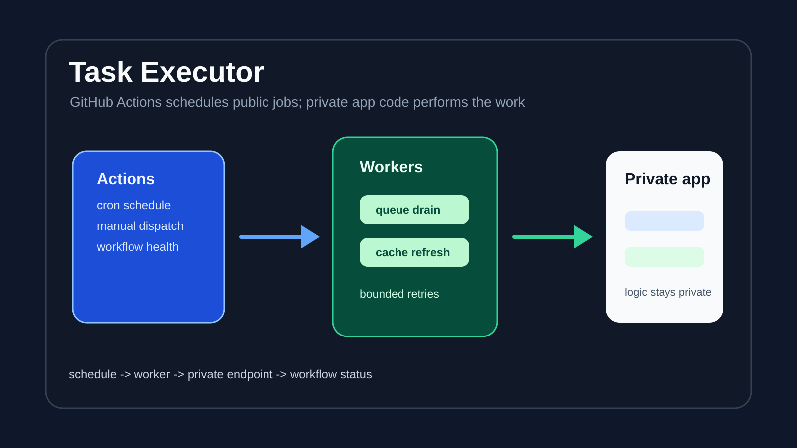

# Task Executor



Task Executor is a public GitHub Actions scheduler package for recurring App maintenance tasks. It keeps scheduling, dispatch, and public verification material outside the private application code.

## What It Does

- Runs scheduled workflow jobs from GitHub Actions.
- Drains stalled operation queue work through the private app endpoint.
- Refreshes cache data through the private app endpoint.
- Supports manual workflow dispatch for controlled operational checks.
- Keeps business logic and sensitive runtime behavior in the private application repository.

## Highlights

- **Public scheduler, private logic:** the public repo owns workflow timing and request shape, while private code handles the work.
- **Strict drain behavior:** queue draining uses a single-item loop with bounded retries and continuation controls.
- **GitHub-native visibility:** workflow run status acts as the health signal.
- **Operational docs included:** setup, quickstart, security, verification, rollout, and migration notes are kept with the workflows.

## Quick Start

Review setup and verification docs:

```text
docs/SETUP.md
docs/QUICKSTART.md
docs/VERIFICATION.md
docs/SECURITY.md
```

Run the local smoke test:

```bash
./scripts/drain_runner_smoke_test.sh
```

## Project Map

| Path | Purpose |
| --- | --- |
| `.github/workflows/` | Scheduled and manual GitHub Actions workflows |
| `scripts/drain_runner.sh` | Drain worker shell runner |
| `scripts/drain_runner_smoke_test.sh` | Local smoke check for drain behavior |
| `docs/` | Setup, security, verification, rollout, and migration notes |
| `module.yaml` | Public module manifest for external workflow health |

## Runtime Shape

The public module manifest describes two components:

- `operation_queue_drain`
- `cache_refresh`

Both use GitHub workflow run results as their public health signal.

## Testing

Use the smoke test before changing drain behavior:

```bash
./scripts/drain_runner_smoke_test.sh
```

Then review workflow dispatch behavior through GitHub Actions when publishing changes.

## Notes

This repository intentionally leaves API endpoint implementations, database work, private business logic, and deployment details in the private application repository.

